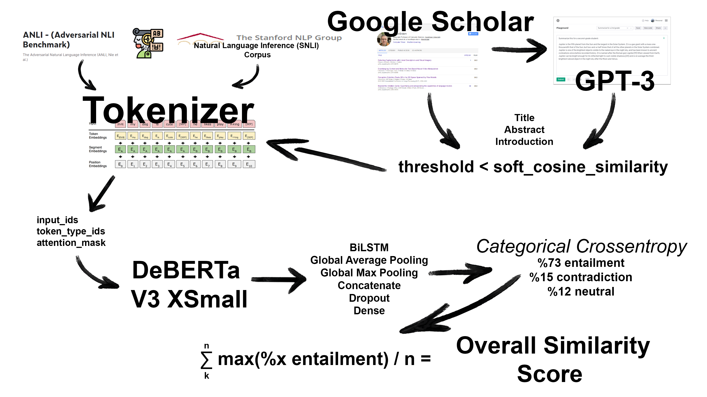

<h1 style="text-align: center;">Success of AI Writers</h1>

<em><a href="https://www.linkedin.com/in/a-emreusta/">Ahmet Emre Usta</a></em> & <em><a href="https://www.linkedin.com/in/huseyin-yigit-ulker/">Hüseyin Yiğit Ülker</a></em> 

>Hacettepe University Artificial Intelligence Engineering AIN311 Course Project

<h4 style="text-align: center;
            color: red;">This repo still under development!</h4>

How It is Work?
=============================

Datasets
=============================
SNLI (Standford Natural Language Inference) and ANLI (Adversarial Natural Language Inference) are datasets used to evaluate the performance of natural language processing models.

SNLI is a collection of 570k English language sentence pairs annotated with labels indicating whether the sentences are entailed, contradictory, or neutral with respect to each other. It is often used as a benchmark for evaluating the ability of machine learning models to perform natural language inference, which involves determining the relationship between two sentences.

ANLI is a newer dataset that was created to test the robustness of natural language processing models. It consists of 4.5 million sentence pairs and includes a variety of types of adversarial examples, such as sentences with grammatical errors or sentences that are intentionally misleading.

Both SNLI and ANLI are widely used in the field of natural language processing and are available for download from the internet.

<a href="http://nlp.stanford.edu/projects/snli/">SNLI</a>

>Samuel R. Bowman, Gabor Angeli, Christopher Potts, and Christopher D. Manning. 2015.
>A large annotated corpus for learning natural language inference. 
>Proceedings of the 2015 Conference on Empirical Methods in Natural Language Processing (EMNLP).

<a href="https://github.com/facebookresearch/anli">ANLI</a>

>Nie Yixin, Williams Adina, Dinan Emily, Bansal Mohit, Weston Jasomn, Kiela Douwe. 2020.
>Adversarial {NLI}: A New Benchmark for Natural Language Understanding.
>Proceedings of the 58th Annual Meeting of the Association for Computational Linguistics.
>Association for Computational Linguistics.

<small>Project based on the <a target="_blank" href="https://drivendata.github.io/cookiecutter-data-science/">cookiecutter data science project template</a>. #cookiecutterdatascience</small>

